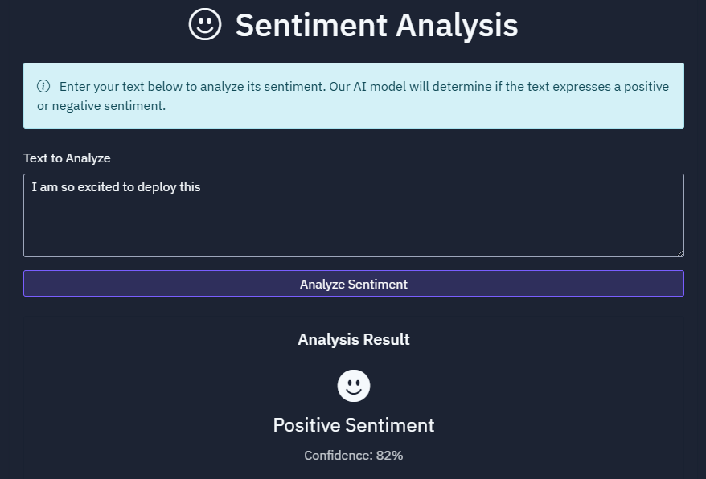
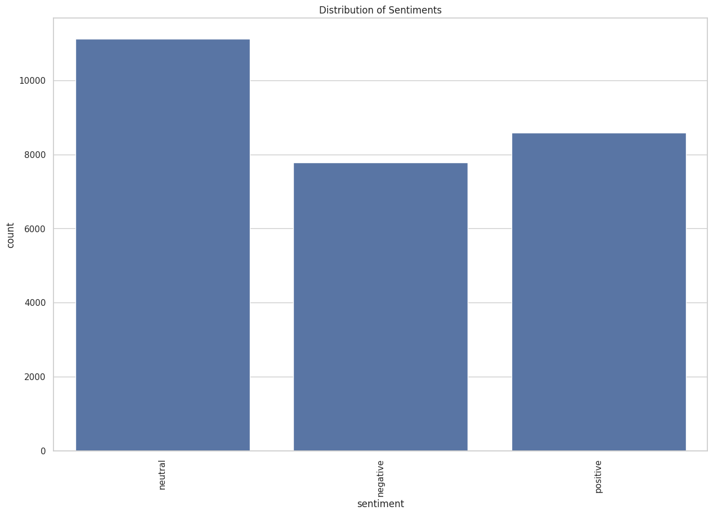
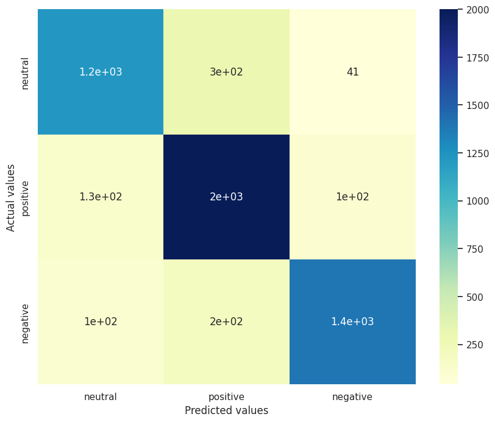
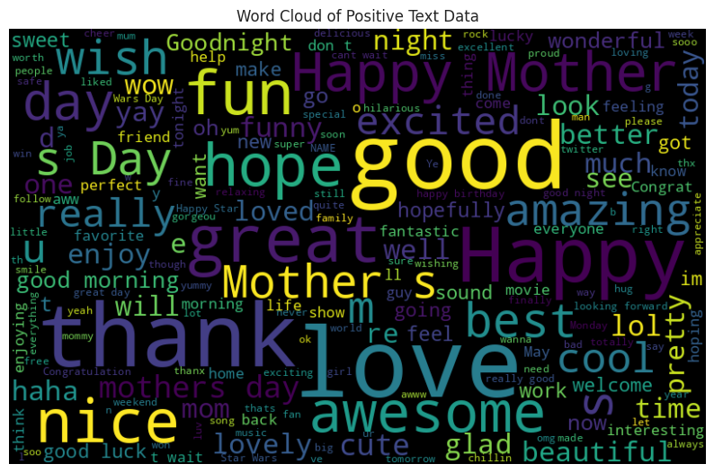
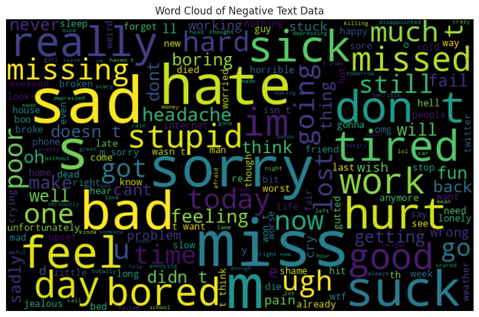

# Sentiment Analysis API



## 📌 Project Overview
Sentiment Analysis is a Natural Language Processing (NLP) task that classifies text as positive, negative, or neutral. This project implements a sentiment analysis API using **Flask** and **Machine Learning models** to predict the sentiment of a given text.

### 🔥 Features
- Sentiment classification: `positive`, `negative`, `neutral`
- API-based predictions using Flask
- ML models: **Logistic Regression, SVM, and Naive Bayes**
- Real-time text processing with `CountVectorizer` and `TF-IDF Transformer`
- Pretrained models loaded from pickle files
- Fully documented API with sample requests

---

## 📊 Dataset & Preprocessing
The dataset consists of **27,481 tweets** labeled as **positive, negative, or neutral**. Data preprocessing includes:
- **Tokenization**: Splitting text into words
- **Stopword Removal**: Removing common words (e.g., "the", "is", "and")
- **TF-IDF Transformation**: Converting text into numerical features

### Sentiment Distribution
```python
import seaborn as sns
import matplotlib.pyplot as plt
sns.countplot(x=df['sentiment'])
plt.title("Sentiment Distribution")
plt.show()
```


---

## ⚙️ Machine Learning Models
We trained **three ML models** for sentiment prediction:
1. **Logistic Regression**
2. **Support Vector Machine (SVM)**
3. **Multinomial Naive Bayes**

### Model Performance
| Model               | Accuracy | F1 Score |
|--------------------|----------|----------|
| Logistic Regression | 83.94%   | 83.78%   |
| SVM                | 83.92%   | 83.74%   |
| Naive Bayes        | 80.61%   | 80.38%   |

### Confusion Matrix (Logistic Regression)
```python
from sklearn.metrics import confusion_matrix
import seaborn as sns
cm = confusion_matrix(y_test, y_pred1)
sns.heatmap(cm, annot=True, cmap="YlGnBu")
plt.xlabel("Predicted")
plt.ylabel("Actual")
plt.show()
```


---

## 🌍 API Usage
The Flask API provides the following endpoints:

### 1️⃣ Health Check
**Endpoint:** `/health`
```bash
curl -X GET http://127.0.0.1:5000/health
```
Response:
```json
{"status": "healthy"}
```

### 2️⃣ Predict Sentiment
**Endpoint:** `/predict`
```bash
curl -X POST http://127.0.0.1:5000/predict -H "Content-Type: application/json" -d '{"text": "I love this product!"}'
```
Response:
```json
{
  "sentiment": "positive",
  "confidence": 0.87
}
```

---

## 🚀 Deployment
### Running Locally
1. Clone the repository:
   ```bash
   git clone https://github.com/yourusername/sentiment-analysis-api.git
   cd sentiment-analysis-api
   ```
2. Install dependencies:
   ```bash
   pip install -r requirements.txt
   ```
3. Run the Flask app:
   ```bash
   python app.py
   ```
4. Access the API at `http://127.0.0.1:5000`

### Docker Deployment
```bash
docker build -t sentiment-api .
docker run -p 5000:5000 sentiment-api
```

---

## 🔍 Results & Insights
### Word Clouds
#### **Positive Words**

#### **Negative Words**


---

## 📜 License
This project is licensed under the **MIT License**.

## 👨‍💻 Contributors
- **Your Name** - [GitHub](https://github.com/ZackHiRo)

---

⭐ If you find this project helpful, give it a star on GitHub! ⭐

